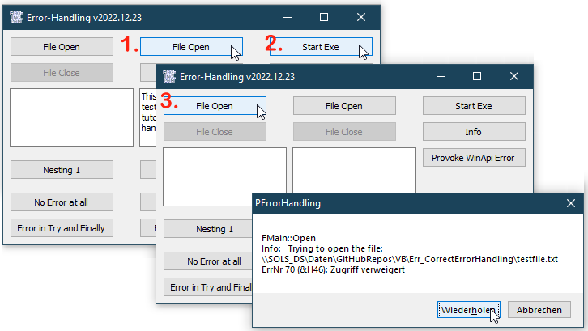

# Err_CorrectErrorHandling  
## How to handle errors in VBA/VBC the easy and correct way  

[](https://github.com/OlimilO1402/Err_CorrectErrorHandling/blob/master/LICENSE) 
[](https://github.com/OlimilO1402/Err_CorrectErrorHandling/releases/latest)
[](https://github.com/OlimilO1402/Err_CorrectErrorHandling/releases/download/v2022.12.23/ErrorHandling_v2022.12.23.zip)


The idea started around may 2005.  

### General

In VBA we often see code similar to the following
```VBA
    On Error GoTo ErrHandler
    '. . . some error-prone code here . . .
    Exit Sub/Function/Property
ErrHandler:
    MsgBox "There was an error"
```

and most of the time it ends up having plenty of MsgBoxes, doing similar things, spread all 
over the code. During an error the user often is in a kind of shock-situation so don't be rude 
and give informations what is to do now!

### Informations Needed

In error messages the following informations are badly needed:
 * the name of the class where the error occurs
 * the name of the function where the error occurs
 * some additional information about the specific object, the filename etc.
 * what the user could do next
 * how to avoid the error in the future
not only for the user but also for you, the developer.

We could easily solve the task by using a globally available standard error message.
So let's use a module for our error messages, maybe we name the module "MErr".

### Syntax

In VB.net there is the Try..Catch..Finally-syntax.
This is very useful because we have a standard syntax always for the same thing and every developer knows how to read it.
But don't hesitate we can do it in VBA very similar like this:
```VBA
Sub DoIt()
Try: On Error GoTo Catch
    
	'here some error-prone code 
	
	GoTo Finally
Catch:
    'Show a proper error-message
Finally:
    'Dispose handles in every case
End Sub
```

Instead of "GoTo Finally" you could also use "Exit Sub", "Exit Function" or "Exit Property", 
at least if we do not have to free any handles. But using "Goto Finally" instead is more 
generic, because you even do not have to distinguish between Sub, Function or Property, so 
reusing the code is made more easily.

Now call the ErrHandler function, which can be private in every class, form or module.
VB already knows the name of the class or form with the function Typename(), so all what we 
have to add is the name of the function.
You even have the chance to call the Try-block more times, by using "Resume Try"
```vba
    If ErrHandler("Open", "Trying to open the file: " & PFN, , , , , True) = vbRetry Then
        Resume Try
    End If
Finally:
End Sub
```

### Handling Errors Inline

If you, the developer, have fundamental knowledge about the errors that can occur in certain 
situations, you should handle the error inline in your code. In such a situation there is no 
need for "Try: On Error" at all. This could be the case if for instance some API-functions or
even your own functions of course, return a Boolean whether a function succeeded or not. 
Do not use Err.Raise in the codes only meant to be used by yourself. 
Just use Err.Raise if you develop some API-functions for other developers, like for instance 
when developing controls, or dlls.

### Handling Errors Explicitely

In every other case for example if you develop with functions of the Windows-API use 
"Try: On Error" if there are explicit errors to occur.
In this case you get Error-codes and you have to translate them to a human readable language.
Just handle the error-code by using the "WinApiErr"-Variable to the ErrHandler function, then 
the error-code will be translated by using FormatMessageW.

This is how the function "ErrHandler" looks like. Just use it in every module, class, form or 
control, the name of it will be added automatically. 
In standard-modules the function "TypeName(Me)" will not work, so simply replace it then with 
the name of the module.

```vba
'copy this same function to every class or form
'the name of the class or form will be added automatically
'in standard-modules the function "TypeName(Me)" will not work, so simply replace it with the name of the Module
' v ############################## v '   Local ErrHandler   ' v ############################## v '
Private Function ErrHandler(ByVal FuncName As String, _
                            Optional AddInfo As String, _
                            Optional WinApiError, _
                            Optional bLoud As Boolean = True, _
                            Optional bErrLog As Boolean = True, _
                            Optional vbDecor As VbMsgBoxStyle = vbOKOnly Or vbCritical, _
                            Optional bRetry As Boolean) As VbMsgBoxResult
    
    If bRetry Then
        
        ErrHandler = MessErrorRetry(TypeName(Me), FuncName, AddInfo, WinApiError, bErrLog)
        
    Else
        
        ErrHandler = MessError(TypeName(Me), FuncName, AddInfo, WinApiError, bLoud, bErrLog, vbDecor)
        
    End If
    
End Function
```

And the globally available Function MessError in the module "MErr" that finally shows the error-message, could look like this:
That's it, simple as that.

```vba
Private Const FORMAT_MESSAGE_MAX_WIDTH_MASK  As Long = &HFF&
Private Const FORMAT_MESSAGE_ALLOCATE_BUFFER As Long = &H100
Private Const FORMAT_MESSAGE_IGNORE_INSERTS  As Long = &H200
Private Const FORMAT_MESSAGE_FROM_STRING     As Long = &H400
Private Const FORMAT_MESSAGE_FROM_HMODULE    As Long = &H800
Private Const FORMAT_MESSAGE_FROM_SYSTEM     As Long = &H1000
Private Const FORMAT_MESSAGE_ARGUMENT_ARRAY  As Long = &H2000
#If VBA7 Then
    Private Declare PtrSafe Function GetLastError Lib "kernel32" () As Long
    Private Declare PtrSafe Function FormatMessageW Lib "kernel32.dll" (ByVal dwFlags As Long, ByRef lpSource As Any, ByVal dwMessageId As Long, ByVal dwLanguageId As Long, ByVal lpBuffer As LongPtr, ByVal nSize As Long, ByRef Arguments As Long) As Long
#Else
    Public Enum LongPtr
        [_]
    End Enum
    Private Declare Function GetLastError Lib "kernel32" () As Long
    Private Declare Function FormatMessageW Lib "kernel32.dll" (ByVal dwFlags As Long, ByRef lpSource As Any, ByVal dwMessageId As Long, ByVal dwLanguageId As Long, ByVal lpBuffer As LongPtr, ByVal nSize As Long, ByRef Arguments As Long) As Long
#End If
Public ErrLog As String

'here 4 different ways to get the error-code and 2 different
'ways to translate the error-code to a human readable string
' * VBC-Runtime:
'     a) Err.Number       -> Err.Description
'     b) Err.LastDllError -> Err.Description
' * Windows-API:
'     c) GetLastError (~=Err.LastDllError) -> FormatMessage
'     d) HResult or any other WinaPI-Error -> FormatMessage

Public Function MessError(ClsName As String, FncName As String, _
                          Optional AddInfo As String = "", _
                          Optional WinApiErr, _
                          Optional bLoud As Boolean = True, _
                          Optional bErrLog As Boolean = True, _
                          Optional vbDecor As VbMsgBoxStyle = vbOKOnly) As VbMsgBoxResult ' vbOKOnly Or vbCritical
    If bLoud Then

        Dim sErr As String:  sErr = ClsName & "::" & FncName
        If Len(AddInfo) Then sErr = sErr & vbCrLf & "Info:   " & AddInfo
        If Err.Number Then sErr = sErr & vbCrLf & "ErrNr " & Err.Number & ": " & Err.Description
        If Err.LastDllError Then sErr = sErr & vbCrLf & "DllErrNr: " & Err.LastDllError & " " & Err.Description
        Dim LastError As Long: LastError = GetLastError
        If LastError Then sErr = sErr & vbCrLf & "LastError " & LastError & ": " & WinApiError_ToStr(LastError)
        If Not IsMissing(WinApiErr) Then sErr = sErr & vbCrLf & "WinApiErr " & WinApiErr & ": " & WinApiError_ToStr(WinApiErr)
        
        MessError = MsgBox(sErr, vbDecor)
    End If
    If bErrLog Then
        ErrLog = ErrLog & vbCrLf & Now & " " & sErr
    End If
End Function

Public Function MessErrorRetry(ClsName As String, FncName As String, _
                               Optional AddInfo As String = "", _
                               Optional WinApiErr, _
                               Optional bErrLog As Boolean = True) As VbMsgBoxResult
    MessErrorRetry = MessError(ClsName, FncName, AddInfo, WinApiErr, True, bErrLog, vbRetryCancel)
End Function

Public Function WinApiError_ToStr(ByVal MessageID As Long) As String
    'MessageID e.g. hResult
    Dim l As Long:   l = 512
    Dim s As String: s = Space(l)
    l = FormatMessageW(FORMAT_MESSAGE_FROM_SYSTEM Or FORMAT_MESSAGE_IGNORE_INSERTS, 0&, MessageID, 0&, StrPtr(s), l, ByVal 0&)
    If l Then WinApiError_ToStr = Left$(s, l)
End Function
```

For a further reading I would recommend this blogpost by Gunnar Morling:  
[What's in a Good Error Message?](https://www.morling.dev/blog/whats-in-a-good-error-message/)

### Code Nesting

In other languages like VB.net we are able to nest a different Try-Catch-Finally inside another Try-Catch-Finally and so on. 
VB.net-code:

```vba
Private Async Sub Button1_Click(sender As Object, e As EventArgs) Handles Button1.Click
    Dim i As Integer = 1
    Dim j As Integer = 0
    Try
        'i = i / j
        Try
            i = i / j
        Catch ex As Exception
            MsgBox("Catch2")
        Finally
            MsgBox("Finally2")
        End Try
    Catch ex As Exception
        MsgBox("Catch1")
    Finally
        MsgBox("Finally1")
    End Try
End Sub
```

Though it looks a bit strange, because the "syntax" is just "made of" linelabels which you can not indent, but if one asks for it, OK there you are:

```vba
Private Sub Command1_Click()
    Dim i As Long: i = 1
    Dim j As Long: j = 0
Try1: On Error GoTo Catch1
    'i = i / j
Try2:   On Error GoTo Catch2
        i = i / j
        GoTo Finally2
Catch2:
        MsgBox "Catch2"
Finally2:
        MsgBox "Finally2"
End_Try2:
    GoTo Finally1
Catch1:
    MsgBox "Catch1"
Finally1:
    MsgBox "Finally1"
End_Try1:
End Sub
'Result:
'Catch2
'Finally2
'Finally1
```

If you can do something in VB.net and in VBA, does not mean you should do it. The other option could be to swap the second Try..Catch to another function.
Maybe also have a look at the video from CodeAesthetic.

links:
* [YouTube: CodeAesthetic "Why You Shouldn't Nest Your Code"](https://www.youtube.com/watch?v=CFRhGnuXG-4)
* [Repo: Langg_AvoidElse](https://github.com/OlimilO1402/Langg_AvoidElse)

### When Does The Error Occur

Up to now we assumed the error occurs only in the "Try-block". But of course unfortunately it can also occur in the "Catch-" or 
"Finally-block". Avoiding errors in the Catch-block is easy, you should only call the Error-Message and do nothing else here.
However, errors in the Finally-block are more likely to occur, because here we want to free and dispose api-handles like registry-, 
file- or graphic-handles, obtained in an object that maybe never got created in the first place.

Many thanks to [Vladimir Vissoultchev Alias wqweto](https://github.com/wqweto) for the issue ticket, the idea and the hints to the complete solution!

There must be a feasible way for any circumstances . . . the following cases:
* either no error message if everything is OK,
* an error-message if error occurs only once in Try
* an error-message if error occurs twice in Try and Finally
* an error-message if error occurs only once in Finally  

The complete guard-package of "Try-Catch-Finally-End_Try" could look like:

```vba
Try: On Error GoTo Catch
    'some error-prone code here
    GoTo Finally
Catch:
    ErrHandler "<NameOfFunction>", "Catch"
    Resume Finally
Finally: On Error GoTo Catch2
    'another possible error could occur here
    GoTo End_Try
Catch2:
    ErrHandler "<NameOfFunction>", "Catch2"
End_Try:
```

Have a look at the code for all 4 cases in the sample-project. (BtnCompleteGuard)
The other option again could be to swap things out to another function with it's own "Try: On Error".

```vba
Private Sub BtnCompleteGuard5_Click()
    'swap things out to another function
Try: On Error GoTo Catch
    TryToOpenFile
Catch:
    ErrHandler "BtnCompleteGuard5_Click", "Catch"
End Sub

Private Sub TryToOpenFile()
    'Error will occur only in the Finally-block
Try: On Error GoTo Catch
    Dim file As PathFileName ' The object never got created
    'file.OOpen
    GoTo Finally
Catch:
    ErrHandler "TryToOpenFile", "Catch"
Finally:
    file.CClose
End Sub
```



